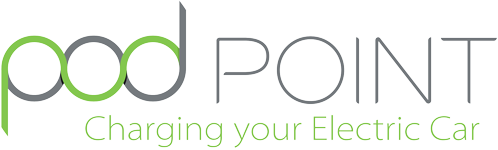

    

# Back-end Technical Test

👋&nbsp;&nbsp;Hello and welcome to our coding test which you'll have to complete before being able to join Pod Point Software Team!

⚠️&nbsp;&nbsp;**Important**: You'll be disqualified in the case that this test has been made publicly accessible in any way.

---

**Table of Contents**

- [Presentation](#presentation)
- [Prerequisites](#prerequisites)
- [Setup your environment](#setup-your-environment)
- [The tasks](#the-tasks)
  - [Back-end task](#the-tasks)
- [Your implementation](#your-implementation)
  - [About you](#about-you)
  - [Your notes](#your-notes)
- [How to submit your test](#how-to-submit-your-test)

---

## Presentation

The purpose of this code challenge is to evaluate your back-end development skill set.

You should approach the task as you would approach any other piece of work, on a typical day. You will have to think about the frameworks, tools, libraries and coding practices you might need to use to make your life easier.

Even if this is a small scale project, we will evaluate the quality, the re-usability and the maintainability of any code produced (markup, css, javascript, typescript, etc.).

You should be able to produce the required work with a fairly high quality finish in an acceptable amount of time.

## Prerequisites

- `git` built in macOS | Git Bash for [Windows](https://git-scm.com/download/win)
- `make` built in macOS | [Windows](https://gist.github.com/evanwill/0207876c3243bbb6863e65ec5dc3f058#make)
- Docker Desktop [macOS](https://hub.docker.com/editions/community/docker-ce-desktop-mac) | [Windows](https://hub.docker.com/editions/community/docker-ce-desktop-windows)
- Stoplight Studio [macOS](https://stoplight.io/studio) | [Windows](https://stoplight.io/studio)

## Setup your environment

We've prepared a dockerised environment using `docker-compose` for this test. Here are the services included:

- **API - Back End**
  - `api` Node.js 14 + TypeScript - to run the API application

All you have to do is running in a terminal:

0. `make` this will list all commands available and what they do
1. `make start`
2. `make build`

This will spin up the following:

- **API**: [http://localhost:3000](http://localhost:3000)

All the services available are using the same Docker network and can communicate with one another. Simply use the service name instead of an IP address or a host name when configuring your applications. You will find more details about this on each task.

⚠️ Make sure you don't have any other server running at the same time using the same ports. We use the following ports: `3000` and `3002`. If you do, feel free to either adapt our `docker-compose.yml` file or shutdown whatever program is currently using these.

## The tasks

We are asking for you to build a very simple API that we've already designed for you as a back-end to list units, start and stop charges.

**Tasks details:**

- [Back-end task](./api/README.md)

---

## Your implementation

Once you're happy with your test, please fill in your details below as well as some notes explaining your approach and implementation.

If you need to explain how to build the API, please use the "Your notes" section within [/api/README.md](./api/README.md).

### About you

- **First name:** `Win`
- **Last name:** `Han`

### Your notes

First of all, thank you for giving me this opportunity. And I am really impressed with the project README.md which explains very well what to expect and what to do.

I tried my best to meet all the criterias expected from the project, especially Object Oriented Programming approach, test driven development, and database schema, models are pretty easy to follow.

The challenge I faced was to dockerise postgres db and api within one container and bridge them.

Things I didnt do are authentication, authorisation, advanced lambda logging and the seed api should be authenticated :).

One thing I have added in the business logic was if the unit has started the charge, it change the status to "Charging", once it stopped, it becomes "Available" vice versa.

And again thank you. Hope I make it.

## How to submit your test

**Only once** your test is completed and you are happy with the code produced, you can
follow these steps to submit it:

1. setup a **private** github repository and push your code (if not already done)
2. **don't use** git submodules
3. **don't modify** the folder structure
4. make sure the latest version of your code is on a `main` branch
5. invite the following GitHub user to review your test: [@podpoint](https://github.com/podpoint)
6. download a zip version of your repository and email it as an attachment to [recruitment@pod-point.com](mailto:recruitment@pod-point.com).

Good luck! 🤞

Thanks for taking the time to do our test, and we look forward to hearing from you.

---

Travel shouldn't damage the earth 🌍

Made with ❤️&nbsp;&nbsp;at [Pod Point](https://pod-point.com)
