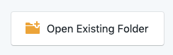

<p align="center">
    
</p>

# API implementation

---

**Table of Contents**

* [Development environment](#development-environment)
    * [Running commands](#running-commands)
    * [Accessing the database](#accessing-the-database)
        * [From within a Docker service](#from-within-a-docker-service)
        * [From your host machine](#from-your-host-machine)
* [The task](#the-task)
    * [The API documentation](#the-api-documentation)
    * [Database & data layer](#database-data-layer)
    * [What is expected](#what-is-expected)
* [Your notes](#your-notes)

---

<a id="development-environment"></a>
## Development environment

Start and build the environment by running `make start` if you haven't already.

Once completed, you'll be able to install the dependencies and prepare the application using `make build`.

Your application will be up and running on [http://localhost:3000](http://localhost:3000).

We do not provide a database container to allow you to use the database technology of your choice for the API application.

Feel free to modify the Docker setup if you need but make sure you justify your changes.

<a id="running-commands"></a>
### Running commands

You can run any command on any of the services / containers from your host machine:

```
$ docker-compose exec {SERVICE_NAME} {YOUR_COMMAND}
```

For example, the `api` service comes with `npm` pre-installed for JS dependencies:

```
$ docker-compose exec api npm
```

The full list of the services we provide and the details for each are listed within the `docker-composer.yml` file located at the root.

---

<a id="the-task"></a>
## The task

You will need to implement a simple API that we've designed for you. 

The goal is to be able to list some units and interact in a simple way by starting and stopping a charge.

<a id="the-api-documentation"></a>
### The API documentation

Please use [Stoplight Studio](https://stoplight.io/studio) in order to browse the API documentation within the `/reference` folder located at the root using the following button:



Once the API is implemented, an API consumer should be able to:

* List all units
* Get the details for one particular unit
* Start a charge on a particular unit while changing its status to "Charging"
* Stop a charge on a particular unit while changing its status to "Available"

You can also import the Open API v3 file located under `/reference/pod-point/openapi.yml` it into [Postman](https://www.postman.com/downloads/) in order to automatically [create a Collection](https://learning.postman.com/docs/postman/collections/importing-and-exporting-data/#collections).

**Note:** If you feel like the API specification is not the most optimised, for example because we are asking you to pass the start and end dates when starting and stopping a charge from a client, this is done intentionally in order to evaluate your abilities.

<a id="database-data-layer"></a>
### Database & data layer

* Create a database schema
* Create the required models/entities representations
* Some seeds/fixtures for the units should be available

<a id="what-is-expected"></a>
### What is expected

We've scaffolded the beginnings of a Serverless / Lambda API for you, ready to be used.

We would like you to:

* Implement a database schema and the data layer
* Follow and implement our API specifications
* Follow coding standards and best practices in order to implement the business logic
* Provide a test suite you think covers this properly
* Provide instructions about how to build/run the application
* Feel like this is the best shot you can possibly give at this, at this point in time in your career
* Have no regrets
* Feel proud of what you produced

**Things we don't expect you to focus on**

* Authentication layer
* Authorisation layer
* API versioning
* Internationalisation

Independently of the level you are applying for, please add anything that you think can be useful for us to better assess your experience/skill level.

If you feel like you're running out of time, we would appreciate if you could provide a list of improvements you could think of.

---

<a id="your-notes"></a>
### Database
 
The data is stored in postgres database which is dockerised.
 
You can run the http://localhost:8000/dev/seed to populate the db with sample data.
The database docker config is setuped in the docker-compose file.
 
### Object oriented approach
 
I used object oriented principles as much as I could. For example, I use singleton for db initialisation, builder pattern for building the object with necessary data, inheritance and encapsulation in data entities, etc.
 
### API Implementation 
 
I set up all four api calls as I follow the openai.yml api which design api calls for the test.
 
api/units - GET - list all units without pagination
api/units/{unitId} - GET - retrieve the details of a unit
api/units/{unitId}/charges - POST - start the charge, change the unit status to “charging” and return the newly created charge’s id in the header of the response.
api/units/{unitId}/charges/{chargeId} - Patch - stop the charge and change back the unit status to “available”.
 
### Error handling
 
There are two major error handlings.
 
- One is for DatabaseException where no requested data is found in the database.
For example, Given id of the unit is not found in db
 
- Another one is validationException which throws an error when the http request is missing data.
 
For validation, I use the Joi library to check the date format of the stated_at and finished_at is correct.
 
For API Http Status code, I follow the openapi.yml file documentation.
- 422 for Validation Error
- 404 for Not Found Error
- 201 for Created Success
- 200 for Get Request Success
- 500 for internal server error
 
### Modification to the build/runtime instructions
- Change the port to 8000 instead of default 3000
- Change the environment to api instead of dev
- Added the postgres database config to docker-compose.yml
 
### Command to run the project
- make start
- make build
 

* to run test cases - cd to api folder and npm run test
 
You can also import the Open API v3 file located under `/reference/pod-point/openapi.yml` it into [Postman](https://www.postman.com/downloads/) in order to automatically [create a Collection]

* Please make sure port 8000 and 5432 is free on your local.

RUN http://localhost:8000/api/seed - to seed the db
 
NOTE: I follow the ISO 8601 date format, the example of date in the imported collection is wrong.

---


Travel shouldn't damage the earth 🌍

Made with ❤️ at [Pod Point](https://pod-point.com)
